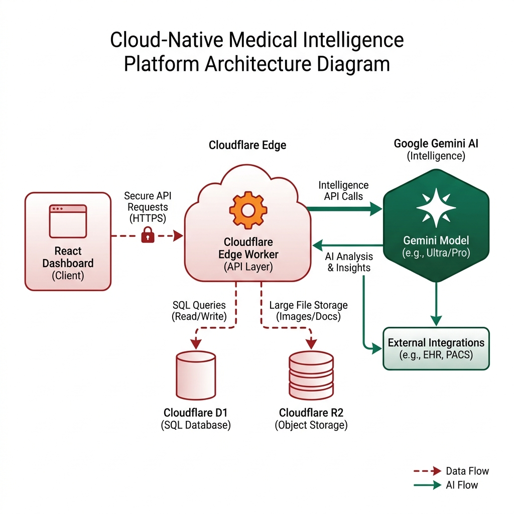

<div align="center">
  
  <br />
  <h1>WashU Sim Intelligence v3.1.0</h1>
  <p><b>Enterprise Simulation & Safety Intelligence Edition</b></p>
  <p><i>Washington University School of Medicine - Department of Emergency Medicine</i></p>

  [](https://github.com/salthepal/WashUSimIntelligence)
  [](https://cloudflare.com)
  [](https://github.com/salthepal/WashUSimIntelligence/security)
</div>

---

## 🏛️ Architecture (v3.1.0 Enterprise)

The **WashU Sim Intelligence** platform is built on a high-concurrency, Zero-Latency distributed architecture. By leveraging Cloudflare's global edge network, we deliver sub-millisecond data persistence and real-time AI report generation.

### 🧩 System Design
<div align="center">
  
</div>

<details>
<summary><b>Click to view technical diagram (Mermaid)</b></summary>

```mermaid
graph TD
    A[React Dashboard (SPA)] --> B[Cloudflare Edge Worker (Hono)]
    B --> C[(Cloudflare D1 SQL)] 
    B --> D[Cloudflare R2 Object Storage]
    B --> E[Cloudflare KV Space]
    B --> F[Google Gemini Flash 1.5]
    
    subgraph "Persistent Storage"
    C
    D
    end
    
    subgraph "Intelligence Engine"
    B
    F
    end
```
</details>

### 🗝️ Core Technologies
- **Frontend**: `React 18` / `TypeScript` / `Vite` / `TailwindCSS`
- **Backend API**: `Cloudflare Workers` / `Hono` (Asynchronous Streaming)
- **Data Persistence**: `D1 SQL` (Relational) / `R2` (Documents) / `KV` (Security)
- **AI Intelligence**: `Google Gemini 1.5 Flash` (Direct Edge Integration)
- **Design System**: `WashU PMS 200` (Primary Red) & `PMS 350` (Forest Green)

---

## 🚀 v3.1.0 Enterprise Features

### 🍱 Official Simulation Prompt (v3.1.0)
The platform now strictly adheres to the **Washington University EM Simulation Department** official guidelines. 
- **Just Culture Framework**: Automated post-session reports prioritize psychological safety and system-level improvements (LSTs).
- **Strict Markdown Structure**: Ensures reports are always ready for institutional executive review.
- **Safety Lexicon**: Integrated standardized safety definitions (In-Situ, Latent Safety Threats, Best Practice Supports).

### 🍱 Streaming Safety Intelligence
*   **Asynchronous Tokens**: Simulation reports generate in real-time, providing instant "voice of the room" synthesis without perceived server latency.
*   **Deep-Content Search (FTS5)**: SQLite-native Full-Text Search enables sub-millisecond queries across thousands of historical clinical scenarios and latent threats.
*   **Offline-Ready (TanStack)**: Persistence layers ensure that simulation specialists can continue their workspace on hospital Wi-Fi without losing session notes.

---

## 🛠️ Deployment & Operations

### Local Development
1.  **Frontend Workspace**:
    ```ps1
    npm run dev
    ```
2.  **Simulation Backend**:
    ```ps1
    cd worker
    npx wrangler dev
    ```

### Production Deployment
The system is automated via GitHub Actions for the frontend and Wrangler for the edge.
```ps1
# Deploy Simulation Backend
cd worker
npx wrangler deploy
```

---

## 🔒 Governance & Security
- **Data Sovereignty**: Managed through Cloudflare's HIPAA-compliant storage primitives (D1/R2).
- **Infrastructure as Code**: All D1 schemas and worker configurations are version-controlled.
- **Institutional Alignment**: Branding and terminology strictly follow the *Washington University School of Medicine* style guidelines.

---

<p align="center">
  <b>Built for Clinical Safety, Powered by Intelligence.</b><br />
  © 2026 Washington University Simulation Intelligence Team
</p>