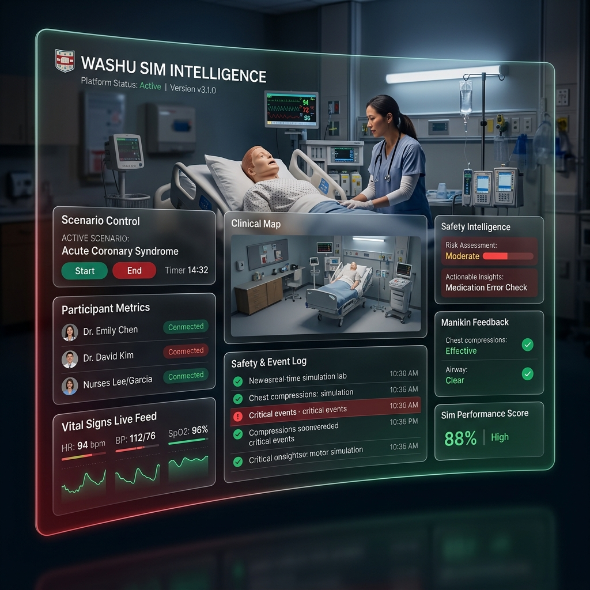

<div align="center">
  
  <br />
  <h1>WashU Sim Intelligence</h1>
  <p><b>Simulation-driven Safety & Learning Intelligence System</b></p>
  <p><i>Washington University School of Medicine - Department of Emergency Medicine</i></p>

  [](https://github.com/salthepal/WashUSimIntelligence)
  [](https://cloudflare.com)
  [](https://ai.google.dev)
</div>

---

## 🏛️ Project Overview

**WashU Sim Intelligence** is a specialized platform designed for the Washington University Department of Emergency Medicine simulation programs. The system streamlines the transition from high-fidelity clinical simulations to actionable safety insights by automating report generation and tracking system-level vulnerabilities.

### 🍱 Main Capabilities

*   **AI-Powered Synthesis**: Real-time generation of simulation reports using advanced LLM prompts tailored to clinical safety and "Just Culture" frameworks.
*   **LST Audit Tracking**: Centralized management of **Latent Safety Threats** with automated revision history, ensuring enterprise-grade auditability.
*   **Universal Search**: High-performance searchable library of clinical scenarios, session notes, and historical reports using FTS5 Full-Text Search.
*   **Atomic Hydration**: Consolidated API loading that populates all core safety datasets in a single PASS, optimized for departmental decision-making.
*   **Offline Resilience**: Specialized persistence layers ensuring simulation specialists can maintain high-fidelity notes in hospital environments with intermittent Wi-Fi.

---

## 🏗️ System Architecture

Built on a globally distributed Cloudflare-native stack for maximum reliability and edge-intelligence:

- **Frontend**: React-based dashboard optimized for clinical and bedside tablet use.
- **Edge API**: High-concurrency Worker layer providing sub-millisecond response times.
- **Intelligence**: Real-time asynchronous streaming via **Google Gemini 3 Flash**.
- **Data Primitives**: Relational SQL (D1), Object Storage (R2), and high-speed metadata (KV).

---

## 🛠️ Getting Started

### Local Development
```bash
# Frontend
npm run dev

# Simulation Worker
cd worker
npx wrangler dev
```

### Production Operations
The system utilizes automated GitHub Actions for frontend deployments and Wrangler for edge worker updates.
```bash
cd worker
npx wrangler deploy
```

---

## 🔒 Security & Governance
- **Just Culture**: Reports are structured to prioritize psychological safety and systemic improvements over individual performance.
- **Data Integrity**: Institutional branding and safety lexicons are strictly enforced via standardized prompts and design tokens.
- **Compliance**: Leveraging HIPAA-compliant storage primitives for clinical data sovereignty.

---

<p align="center">
  <b>Built for Clinical Safety, Powered by Intelligence.</b><br />
  © 2026 Washington University School of Medicine. Emergency Medicine Simulation.
</p>
